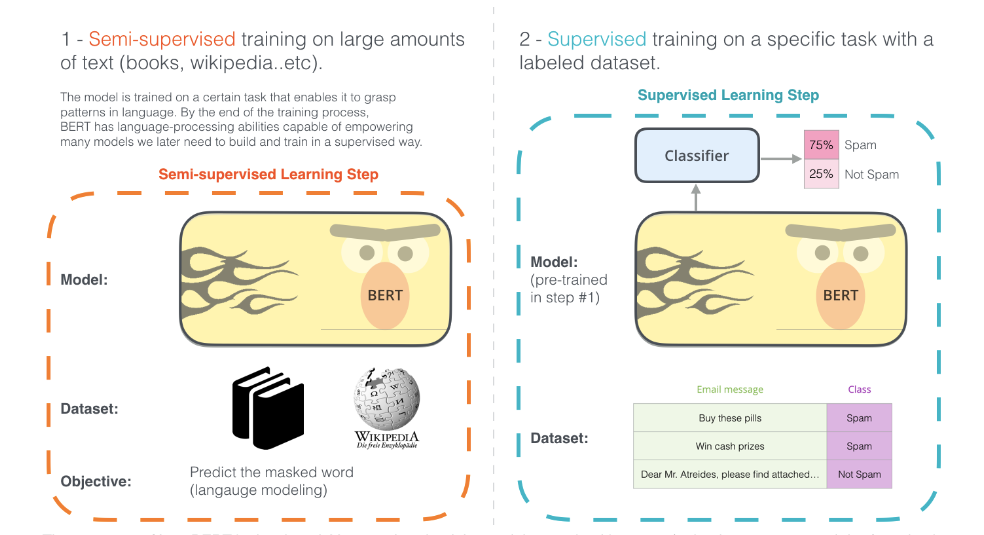
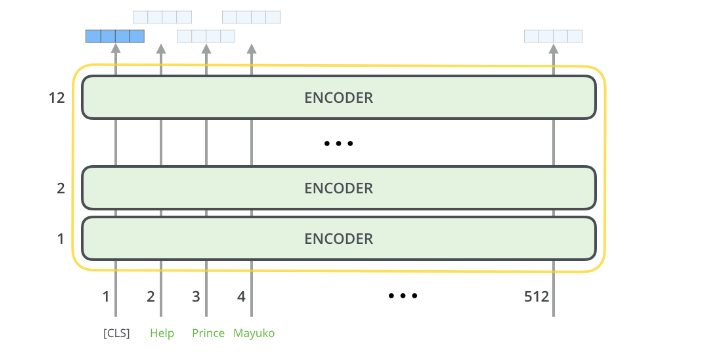
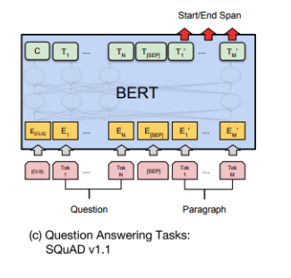

## **Task:** Build a Question Answer System.


### Approach:
1. Exploratory Data Analysis.
2. Data cleaning and preparation.
3. Model training.
4. Testing the model.
5. Performing evaluations on Train and Test data.

### The pipleline of the system is as follows:
* **main.py:** The main file which performs all the tasks from exploratory data analysis, data-preparation, model-training, predictions, evaluations based on command line arguements given by user.
* **Data_prep.py:** Contains the code and functions needed to clean all the train_data and transform the data which is ready to be feeded to the model.
* **model.py:** This file contains the code to use the transformed data to fine-tune the bert model for a question answering task.
* **Predictions.py:** This file contains all the code to perform predictions and evaluations on the testing data and example inputs given by user.
* **utils.py:** This file contains all the helper_functions used in the pipeline.

# main.py


```python
"""
Jyothi Vishnu Vardhan Kolla.

This is the main file which performs tasks such as
explorataroy data anaysis,data-preparation,model-training based on command line inputs.
"""
import sys
from Exploratory_data_analysis import ExploratoryAnalysis
from Data_prep import PrepareData
from models import Models
import pandas as pd
from transformers import BertConfig, BertTokenizer
from utils import load_model
from Predictions import Predictions, Evaluations


def main(argv):
    """
        Main which takes command line arguements and executes the pipeline.

        ARGS:
            argv[1]: if given-1 performs exploratory data analysis on given data.
            argv[2]: if given-1 performing preprocessing and prepares the final data.
            argv[3]: if given-1 performs the training.
            argv[4]: if given-1 performs predictions based on given inputs.
            argv[5]: if given-1 performs evaluations and displays them.
    """
    perform_eda = int(argv[1])
    prepare_data = int(argv[2])
    train_mode = int(argv[3])
    prediction_mode = int(argv[4])
    evaluation_mode = int(argv[5])

    # Paths to data.
    train_tsv_path = "/Users/jyothivishnuvardhankolla/Desktop/SoftinWay/WikiQACorpus/WikiQA-train.tsv"
    dev_tsv_path = "/Users/jyothivishnuvardhankolla/Desktop/SoftinWay/WikiQACorpus/WikiQA-dev.tsv"
    test_tsv_path = "/Users/jyothivishnuvardhankolla/Desktop/SoftinWay/WikiQACorpus/WikiQA-test.tsv"

    if perform_eda == 1:  # If given 1 by user perfrom EDA.
        # Initialize the ExploratoryAnalysis object.
        ob = ExploratoryAnalysis(train_tsv=train_tsv_path, dev_tsv=dev_tsv_path,
                                 test_tsv=test_tsv_path)

        ob.exploreTrainTsv()  # Performs EDA for TrainTSV.
        ob.exploreDevTsv()  # Performs EDA for DevTSV.
        ob.exploreTestTsv()  # Performs EDA for TestTSV

    if prepare_data == 1:  # If given 1 by user prepares the data need to train the model.
        pos_ans_path = "/Users/jyothivishnuvardhankolla/Desktop/SoftinWay/WikiQACorpus/WikiQASent.pos.ans.tsv"
        # Initialize the PrepareData object.
        ob = PrepareData(train_tsv=train_tsv_path, dev_tsv=dev_tsv_path,
                         test_tsv=test_tsv_path, pos_ans_tsv=pos_ans_path)
        # Preprocess the data and prepares the final data that is ready for training.
        ob.Preprocess()

    # Note: Run prepare data atleast once before running for training data to be available.
    if train_mode == 1:  # If given 1 by user the model training begins.
        train_df = pd.read_csv("data/train.csv")  # Load the train_df.
        dev_df = pd.read_csv("data/dev.csv")  # Load the dev_df.
        test_df = pd.read_csv("data/test.csv")  # Load the test_df
        ob = Models(train_df, dev_df, test_df)
        ob.train_model()  # Train the model.

    # Note: Run train_model atleast once before you run this.
    if prediction_mode == 1:  # If given 1 by user prediction mode turns on.
        loaded_model = load_model("Models")
        # Load tokenizer from fine-tuned model.
        tokenizer = BertTokenizer.from_pretrained("Models")
        # Initialize the Predictions object.
        ob = Predictions(loaded_model, tokenizer)
        question = "How will Diaphragm Pump work"  # Input question
        context = "A diaphragm pump (also known as a Membrane pump, Air Operated Double Diaphragm Pump (AODD) or Pneumatic Diaphragm Pump) is a positive displacement pump that uses a combination of the reciprocating action of a rubber , thermoplastic or teflon diaphragm and suitable valves either side of the diaphragm ( check valve , butterfly valves, flap valves, or any other form of shut-off valves) to pump a fluid ."
        # Make a prediction using the loaded model and tokenizer
        answer = ob.make_prediction(question, context)
        print("Answer:", answer)

    # Note: Run train_model atleast once before you run this.
    if evaluation_mode == 1:  # If given 1 by user computes and displays the metrics.
        loaded_model = load_model("Models")
        tokenizer = BertTokenizer.from_pretrained("Models")
        train_df = pd.read_csv("data/train.csv")
        dev_df = pd.read_csv("data/dev.csv")
        test_df = pd.read_csv("data/test.csv")
        eval_df = pd.read_csv("data/eval.csv")
        ob1 = Predictions(loaded_model, tokenizer)  # Predictions object.
        # Evaluations object.
        ob2 = Evaluations(train_df, dev_df, test_df, eval_df,
                          loaded_model, tokenizer, ob1)
        # Compute predictions and store them in a csv_file.
        ob2.compute_store_predictions()
        pr, re, f1 = ob2.display_metrics(pd.read_csv(
            "/Users/jyothivishnuvardhankolla/Desktop/SoftinWay/Chatbot-development/data/predictions.csv"))
        print(f"train data:Precision is {pr} and recall is {re} and f1-score is {f1}")
        pr, re, f1 = ob2.display_metrics(pd.read_csv("/Users/jyothivishnuvardhankolla/Desktop/SoftinWay/Chatbot-development/data/eval_predictions.csv"))
        print(f"test data:Precision is {pr} and recall is {re} and f1-score is {f1}")


if __name__ == "__main__":
    main(sys.argv)

```

### Order of Execution.
1. Run the following command in command line python main.py "arg1" "arg2" "arg3" "arg4" "arg5"
* **if arg-1=1** then the code base performs exploratary data analysis and displays the results.
* **if arg-2=1** then the code base performs data cleaning and transforms it into form which is ready to be used to fine tune the Bert model for Question Answering task.
* **if arg-3=1** then the code base trains the model by taking the transformed data.
* **if arg-4=1** then the code base takes a input question and context given by user and returns the predicted results.
* **if arg-5=1** then the code base computes the token-level precision, recall, f1-score for the entire training and evaluation datasets.

### **Step-1:** Exploratory Data Analysis.


```python
if perform_eda == 1:  # If given 1 by user perfrom EDA.
        # Initialize the ExploratoryAnalysis object.
        ob = ExploratoryAnalysis(train_tsv=train_tsv_path, dev_tsv=dev_tsv_path,
                                 test_tsv=test_tsv_path)

        ob.exploreTrainTsv()  # Performs EDA for TrainTSV.
        ob.exploreDevTsv()  # Performs EDA for DevTSV.
        ob.exploreTestTsv()  # Performs EDA for TestTSV
```

* **As shown in the above code snippet it first initialized the object of ExploratoryDataAnalysis class with paths of train, dev, test data sets and calls functions which displays the results for each of train, dev, test sets.**

* **The ExloratoryAnalysis class in present in the Exploratory_data_analysis.py file given below.**

# Exploratory_data_analysis.py


```python
"""
Jyothi Vishnu Vardhan Kolla.

This file contains code to perform exporatory data analysis.
"""

import numpy as np
import pandas as pd


class ExploratoryAnalysis:
    def __init__(self, train_tsv: str, dev_tsv: str, test_tsv: str):
        """
        Initializes the train, dev, test paths with class variables.

        ARGS:
            train_tsv: Path to train_tsv file.
            dev_tsv: Path to dev_tsv file.
            test_tsv: Path to test_tsv file.
        """
        self.train_tsv_path = train_tsv
        self.dev_tsv_path = dev_tsv
        self.test_tsv_path = test_tsv

    def exploreData(self, data_path):
        # Read and display the file as pandas dataFrame.
        df = pd.read_csv(data_path, delimiter='\t')
        print(df.head(5))

        # Get the number of data in the data.
        print(f"The number of data points in train_tsv file are {df.shape[0]}")

        # Check for the number of questions.
        unique_questions = df['QuestionID'].unique()
        print(f"The number of unique questions are  {len(unique_questions)}")

        # check the count of no.of documents.
        no_of_documents = df['DocumentID'].unique()
        print(
            f"The number of documents in train_tsv file is {len(no_of_documents)}")

        # find the average no.of questions per document.
        avg_questions_per_doc = df.groupby(
            'DocumentID')['QuestionID'].nunique().mean()
        # Print the result
        print("Average number of unique QuestionID values per DocumentID:",
              avg_questions_per_doc)

        # get list of documents with more than one question.
        docs_with_multiple_questions = df.groupby('DocumentID').filter(
            lambda x: x['QuestionID'].nunique() > 1)['DocumentID'].unique()
        print(docs_with_multiple_questions)
        print(
            f"No of documents with more than one question is {len(docs_with_multiple_questions)} which is {len(no_of_documents) / len(docs_with_multiple_questions)}%")

        # Find the average number of answers per question.
        average_no_of_answers_per_question = df.groupby(
            'QuestionID')['SentenceID'].nunique().mean()
        print(
            f"Average no.of answers per question {average_no_of_answers_per_question}")

    def exploreTrainTsv(self):
        print(f"\nExploratory DataAnalysis of train_tsv data")
        self.exploreData(self.train_tsv_path)

    def exploreDevTsv(self):
        print(f"\nExploratory DataAnalysis of dev_tsv data")
        self.exploreData(self.dev_tsv_path)

    def exploreTestTsv(self):
        print(f"\nExploratory DataAnalysis of test_tsv data")
        self.exploreData(self.test_tsv_path)

```

### Obtained Results are as follows:
<pre>
Exploratory DataAnalysis of train_tsv data

  QuestionID                       Question DocumentID DocumentTitle SentenceID                                           Sentence  Label
0         Q1  how are glacier caves formed?         D1  Glacier cave       D1-0  A partly submerged glacier cave on Perito More...      0
1         Q1  how are glacier caves formed?         D1  Glacier cave       D1-1          The ice facade is approximately 60 m high      0
2         Q1  how are glacier caves formed?         D1  Glacier cave       D1-2          Ice formations in the Titlis glacier cave      0
3         Q1  how are glacier caves formed?         D1  Glacier cave       D1-3  A glacier cave is a cave formed within the ice...      1
4         Q1  how are glacier caves formed?         D1  Glacier cave       D1-4  Glacier caves are often called ice caves , but...      0

The number of data points in train_tsv file are 20347
The number of unique questions are  2117
The number of documents in train_tsv file is 1994

Average number of unique QuestionID values per DocumentID: 1.0616850551654964
['D6' 'D27' 'D31' 'D41' 'D50' 'D89' 'D100' 'D124' 'D125' 'D128' 'D129'
 'D134' 'D155' 'D160' 'D169' 'D179' 'D195' 'D211' 'D212' 'D215' 'D219'
 'D230' 'D251' 'D252' 'D255' 'D269' 'D275' 'D292' 'D309' 'D320' 'D342'
 'D351' 'D352' 'D359' 'D363' 'D368' 'D370' 'D371' 'D377' 'D380' 'D432'
 'D438' 'D449' 'D473' 'D521' 'D528' 'D543' 'D549' 'D557' 'D587' 'D589'
 'D607' 'D624' 'D698' 'D729' 'D763' 'D771' 'D773' 'D806' 'D855' 'D857'
 'D216' 'D881' 'D885' 'D484' 'D979' 'D1016' 'D1018' 'D1054' 'D1055'
 'D1065' 'D1081' 'D1111' 'D1142' 'D1148' 'D1158' 'D1196' 'D1197' 'D1198'
 'D1207' 'D1263' 'D1282' 'D1298' 'D1302' 'D1308' 'D1318' 'D1454' 'D1455'
 'D1525' 'D1566' 'D1616' 'D1621' 'D1652' 'D660' 'D1703' 'D1832' 'D1855'
 'D1868' 'D1876' 'D1559' 'D332' 'D2045' 'D2065' 'D2089' 'D2141' 'D2174'
 'D2212' 'D2319' 'D2452' 'D2477']
 
No of documents with more than one question is 110 which is 18.12727272727273%
Average no.of answers per question 9.611242324043458

Exploratory DataAnalysis of dev_tsv data

  QuestionID                                     Question DocumentID     DocumentTitle SentenceID                                           Sentence  Label
0         Q8  How are epithelial tissues joined together?         D8  Tissue (biology)       D8-0  Cross section of sclerenchyma fibers in plant ...      0
1         Q8  How are epithelial tissues joined together?         D8  Tissue (biology)       D8-1  Microscopic view of a histologic specimen of h...      0
2         Q8  How are epithelial tissues joined together?         D8  Tissue (biology)       D8-2  In Biology , Tissue is a cellular organization...      0
3         Q8  How are epithelial tissues joined together?         D8  Tissue (biology)       D8-3  A tissue is an ensemble of similar cells from ...      0
4         Q8  How are epithelial tissues joined together?         D8  Tissue (biology)       D8-4  Organs are then formed by the functional group...      0

The number of data points in train_tsv file are 2733
The number of unique questions are  296
The number of documents in train_tsv file is 293
Average number of unique QuestionID values per DocumentID: 1.0102389078498293
['D318' 'D1008' 'D1361']
No of documents with more than one question is 3 which is 97.66666666666667%
Average no.of answers per question 9.233108108108109

Exploratory DataAnalysis of test_tsv data

  QuestionID                                         Question DocumentID  ... SentenceID                                           Sentence Label
0         Q0  HOW AFRICAN AMERICANS WERE IMMIGRATED TO THE US         D0  ...       D0-0  African immigration to the United States refer...     0
1         Q0  HOW AFRICAN AMERICANS WERE IMMIGRATED TO THE US         D0  ...       D0-1  The term African in the scope of this article ...     0
2         Q0  HOW AFRICAN AMERICANS WERE IMMIGRATED TO THE US         D0  ...       D0-2  From the Immigration and Nationality Act of 19...     0
3         Q0  HOW AFRICAN AMERICANS WERE IMMIGRATED TO THE US         D0  ...       D0-3  African immigrants in the United States come f...     0
4         Q0  HOW AFRICAN AMERICANS WERE IMMIGRATED TO THE US         D0  ...       D0-4  They include people from different national, l...     0

[5 rows x 7 columns]

The number of data points in train_tsv file are 6116
The number of unique questions are  630
The number of documents in train_tsv file is 616
Average number of unique QuestionID values per DocumentID: 1.0227272727272727
['D186' 'D270' 'D330' 'D332' 'D660' 'D878' 'D996' 'D1035' 'D1241' 'D1349'
 'D1764' 'D2097']
No of documents with more than one question is 12 which is 51.333333333333336%
Average no.of answers per question 9.707936507936507
(tensorflow-gpu) jyothivishnuvardhankolla@Jyothis-MacBook-Pro Chatbot-development % 
</pre>

# **Step-2:** Data cleaning and preparation. 

1. **Remove all the data points which have a sentence which do not contain correct answer.**
2. **Get all unique questions in each of the data-split.**
3. **Merge all the data-splits with all annotated answers from annotated dataset to create a final dataset with all the valid datapoints.**
4. **Create the final valid dataset suitable for training by creating a dataframe with columns Question, Sentence, Answer**

#### Key observations:
* **There are a total of 1039 questions in the train_data with a proper answer.**
* **There are a total of 140 questions in the train_data with a proper answer.**
* **There are a total of 291 questions in the train_data with a proper answer.**


```python
if prepare_data == 1:  # If given 1 by user prepares the data need to train the model.
        pos_ans_path = "/Users/jyothivishnuvardhankolla/Desktop/SoftinWay/WikiQACorpus/WikiQASent.pos.ans.tsv"
        # Initialize the PrepareData object.
        ob = PrepareData(train_tsv=train_tsv_path, dev_tsv=dev_tsv_path,
                         test_tsv=test_tsv_path, pos_ans_tsv=pos_ans_path)
        # Preprocess the data and prepares the final data that is ready for training.
        ob.Preprocess()
```

**As shown above it takes the path to annotated datasets and Initializes the object of PrepareData class from Data_prep.py file, then calls Preprocess function which performs all the cleaning and transformations required for fine-tuning the model as shown below**

# Data_prep.py


```python
import pandas as pd


class PrepareData:
    def __init__(self, train_tsv: str, dev_tsv: str, test_tsv: str, pos_ans_tsv: str):
        """
        Creates the Necessary datframes required to create the final_data,
        Initialize the object of this class with following args and then call 
        preprocess function to prepare your data.

        ARGS:
            train_tsv: Path to train_tsv file.
            dev_tsv: Path to dev_tsv file.
            test_tsv: Path to test_tsv file.
        """
        self.train_tsv_path = train_tsv
        self.dev_tsv_path = dev_tsv
        self.test_tsv_path = test_tsv
        self.pos_ans_tsv = pos_ans_tsv

        # Initialize variables to store dataframes.
        self.pos_ans_tsv_df = None
        self.train_tsv_df = None
        self.dev_tsv_df = None
        self.test_tsv_df = None

        # Initialize variables to store final train, dev, test dataframes.
        self.final_train_df = None
        self.final_dev_df = None
        self.final_test_df = None

    def create_data_frames(self):
        # Creates the train, dev, test, pos_ans dataframes.
        self.pos_ans_tsv_df = pd.read_csv(self.pos_ans_tsv, delimiter="\t")
        self.train_tsv_df = pd.read_csv(self.train_tsv_path, delimiter="\t")
        self.dev_tsv_df = pd.read_csv(self.dev_tsv_path, delimiter="\t")
        self.test_tsv_df = pd.read_csv(self.test_tsv_path, delimiter="\t")

    def create_final_df(self, df: pd.DataFrame):
        # Takes in a dataframe and creates a new df ready for training
        final_dict = {
            'question': [],
            'sentence': [],
            'answer': []
        }

        for i, row in df.iterrows():
            # Iterate through each row and create new row for each of correct answer.
            if pd.notna(row['AnswerPhrase1']) and row['AnswerPhrase1'] != 'NO_ANS':
                final_dict['question'].append(row['Question'])
                final_dict['sentence'].append(row['Sentence'])
                final_dict['answer'].append(row['AnswerPhrase1'])

            if pd.notna(row['AnswerPhrase2']) and row['AnswerPhrase2'] != 'NO_ANS':
                final_dict['question'].append(row['Question'])
                final_dict['sentence'].append(row['Sentence'])
                final_dict['answer'].append(row['AnswerPhrase2'])

            if pd.notna(row['AnswerPhrase3']) and row['AnswerPhrase3'] != 'NO_ANS':
                final_dict['question'].append(row['Question'])
                final_dict['sentence'].append(row['Sentence'])
                final_dict['answer'].append(row['AnswerPhrase3'])

        return pd.DataFrame(final_dict)

    def Preprocess(self):
        # Creates the final cleaned datasets and stored them in disk.
        self.create_data_frames()  # Create dataframes.
        # Preprocess the dataframes(eliminate all rows with incorrect sentences.)
        cleaned_train_tsv_data = self.train_tsv_df[self.train_tsv_df["Label"] == 1]
        cleaned_dev_tsv_data = self.dev_tsv_df[self.dev_tsv_df["Label"] == 1]
        cleaned_test_tsv_data = self.test_tsv_df[self.test_tsv_df["Label"] == 1]

        # Get list of all unique_questions in the cleaned data.
        unique_questions_train = cleaned_train_tsv_data['QuestionID'].unique()
        unique_questions_dev = cleaned_dev_tsv_data['QuestionID'].unique()
        unique_questions_test = cleaned_test_tsv_data['QuestionID'].unique()

        # separate train_pos_ans_df for each of train, dev, test.
        train_pos_ans_tsv = self.pos_ans_tsv_df[self.pos_ans_tsv_df['QuestionID'].isin(
            unique_questions_train)]
        dev_pos_ans_tsv = self.pos_ans_tsv_df[self.pos_ans_tsv_df['QuestionID'].isin(
            unique_questions_dev)]
        test_pos_ans_tsv = self.pos_ans_tsv_df[self.pos_ans_tsv_df['QuestionID'].isin(
            unique_questions_test)]

        # Merge train, dev, test dataframes with pos_ans dataframes.
        merged_train_df = pd.merge(train_pos_ans_tsv, cleaned_train_tsv_data, on=[
                                   "QuestionID", "Question", "DocumentID", "DocumentTitle", "SentenceID", "Sentence"])
        merged_dev_df = pd.merge(dev_pos_ans_tsv, cleaned_dev_tsv_data, on=[
                                 "QuestionID", "Question", "DocumentID", "DocumentTitle", "SentenceID", "Sentence"])
        merged_test_df = pd.merge(test_pos_ans_tsv, cleaned_test_tsv_data, on=[
                                  "QuestionID", "Question", "DocumentID", "DocumentTitle", "SentenceID", "Sentence"])

        # Create the final dataframes.
        self.final_train_df = self.create_final_df(merged_train_df)
        self.final_dev_df = self.create_final_df(merged_dev_df)
        self.final_test_df = self.create_final_df(merged_test_df)

        # Save the final dataframes in a csv file.
        self.final_train_df.to_csv("data/train.csv", index=False)
        self.final_dev_df.to_csv("data/dev.csv", index=False)
        self.final_test_df.to_csv("data/test.csv", index=False)

```

**The final data-set contains a total of 1941 data points with Question,Sentence,Answer columns**

# Step-3:Model training.

**I have used Fine-tuned Bert to build the question-answering system.**
1. First lets discuss about the Bert model which is basically a trained Transformer encoded stack.

2. As shown in the above picture Bert is first trained in a Semi-Supervised setting on large amount of data and then it can be used for various NLP tasks such as classification, Question-Answering etc.
3. Bert has a total of two variants which are Bert-Base, Bert-Large where Bert-base has 12 attention heads and Bert-large has 16 attention heads with 768 and 1024 hidden units respectively.

**Training Process for Bert**

1. The First Input is always supplied with a special [CLS] token and each encoder layer will itself contain one Self-attention and its outputs are passed through a feed-forward network.
2. One of the two important features of Bert are Masked Language Model(Randomly mask 15% of tokens) and Two-sentence Tasks (Given two sentences A and B is B likely to be sentence that follows A?)
3. This is how we modify and Fine-Tune bert for Question-Answering task as shown in the Bert official paper.


**Learning rate of 5 * 10 ^ -5 was choosed while fine-tuning for making model converge steadily and avoid overshooting the optimal solution.**

**When it comes to loss function I have choosed Sparse-Categorical-Crossentropy this is because each position in the context can be considered a potential answer which makes it a multi-class problem with so many classes**


```python
 # Note: Run prepare data atleast once before running for training data to be available.
    if train_mode == 1:  # If given 1 by user the model training begins.
        train_df = pd.read_csv("data/train.csv")  # Load the train_df.
        dev_df = pd.read_csv("data/dev.csv")  # Load the dev_df.
        test_df = pd.read_csv("data/test.csv")  # Load the test_df
        ob = Models(train_df, dev_df, test_df)
        ob.train_model()  # Train the model.
```

* As shown in the above code snippet it first initialized the object of Models class with paths of train, dev, test data sets and calls functions which trains the fine-tuned bert-base for 10 epochs.
* The Model class in present in models.py file given below.


```python
"""
Jyothi Vishnu Vardhan Kolla.

This files contains the code to train and build models.
"""

import pandas as pd
import numpy as np
import pandas as pd
import matplotlib.pyplot as plt
import tensorflow as tf
from transformers import BertTokenizer
from transformers import TFBertModel
from utils import preprocess_data
from transformers import CONFIG_MAPPING


class Models:
    def __init__(self, train_data=None, dev_data=None, test_data=None):
        """
        Takes the training_data, dev_data, test_data into one
        final_data and trains the model.

        Args:
            train_data: training dataframe.
            dev_data: dev_dataframe.
            test_data: testing_dataframe.
        """
        self.train_data = train_data
        self.dev_data = dev_data
        self.test_data = test_data

        # Combine the three data frames into a single dataframe.
        self.final_data = pd.concat(
            [self.train_data, self.dev_data, self.test_data], ignore_index=True)
        self.sequence_length = 384
        # Load pretrained tokenizer from bert model.
        self.tokenizer = BertTokenizer.from_pretrained('bert-base-uncased')

    def prepare_data(self):
        # Prepare the x_train and y_train splits to make it ready for training.
        x_train, y_train = preprocess_data(questions=self.final_data['question'],
                                           sentences=self.final_data['sentence'],
                                           answers=self.final_data['answer'],
                                           tokenizer=self.tokenizer,
                                           seq_length=self.sequence_length)
        return x_train, y_train

    def create_qa_model(self):
        # Finetunes the Bert model for question-answering task.
        input_ids = tf.keras.layers.Input(
            shape=(self.sequence_length, ), dtype=tf.int32, name='input_ids')
        attention_mask = tf.keras.layers.Input(
            shape=(self.sequence_length,), dtype=tf.int32, name="attention_mask")

        bert = TFBertModel.from_pretrained(
            'bert-base-uncased', return_dict=True)
        sequence_output = bert([input_ids, attention_mask])[
            'last_hidden_state']

        start_logits = tf.keras.layers.Dense(
            1, name='start_position')(sequence_output)
        # output layer to predict first_idx of answer.
        start_logits = tf.keras.layers.Flatten()(start_logits)

        end_logits = tf.keras.layers.Dense(
            1, name='end_position')(sequence_output)
        # output layer to predict last_idx of answer.
        end_logits = tf.keras.layers.Flatten()(end_logits)

        model = tf.keras.Model(inputs=[input_ids, attention_mask], outputs=[
                               start_logits, end_logits])
        return model

    def train_model(self):
        # trains the fine-tuned model for qa_task,
        x_train, y_train = self.prepare_data()
        qa_model = self.create_qa_model()

        optimizer = tf.keras.optimizers.legacy.Adam(learning_rate=5e-5)
        loss = tf.keras.losses.SparseCategoricalCrossentropy(from_logits=True)
        qa_model.compile(optimizer=optimizer, loss=loss, metrics=['accuracy'])

        epochs = 10
        batch_size = 8

        history = qa_model.fit(x_train, [y_train['start_position'],
                                         y_train['end_position']], epochs=epochs, batch_size=batch_size)

        model_save_path = "/Users/jyothivishnuvardhankolla/Desktop/SoftinWay/Chatbot-development/Models"

        # Save the model weights
        qa_model.save_weights(model_save_path + "/tf_model.h5")

        # Save the tokenizer
        self.tokenizer.save_pretrained(model_save_path)

        # Save the config
        config = CONFIG_MAPPING["bert"]()
        config.save_pretrained(model_save_path)

```

### Reasons for selecting Bert model and not selecting models such as GPT and T5
1. **Bidirectional Context:** Bert is designed to capture context in both left and right sides of the token, thus this bidirectional context in bert allows it to better understand the contextual relation between words in a sentence. As explained in Bert paper GPT process the text in uni-directional way which limits its ability to understand context in text and more suitable for text generation tasks. Although T5 is bi-directional it is not as optimized as bert for bidirectional context representation.

2. **Pre-training Objectives:** Masked Language Modelling and Next Sentence Prediction methods in Pre-training Bert makes Bert better understand language and context which is more useful for tasks like question answering while on contrast GPT uses a uni-directional modelling objective while T5 uses denoising autoencoder objective.


### Evaluation Metrics For Question Answering
**How can we evaluate how better our model is performing with help of metrics such as Accuracy, Precision, Recall, F1-Score.**

* As we are dealing with Question-Answering which is just as same as classification predicting the first and last index of the answer in sentence but as per the Bert paper they used a slightly modified version of these metrics to evaluate their model.
* Accuracy -> We evaluate Accuracy as follows we compute accuracy for both the first_index and last_index predictions.
* Precision -> It is caluculated as (Number of correct tokens in the predicted answer) / (Total number of tokens in the predicted answer).
* Recall -> It is caluculated as (Number of correct tokens in the predicted answer) / (Total number of tokens in the actual answer).
* F1-score -> 2 * (Precision * Recall) / (Precision + Recall)

**In this way these metrics are computed for every data point in the dataset and then average values are reported as the overall performance of the model.**

Let's understand this with an example.<br>
Actual Answer: "Paris"<br>
Predicted Answer: "Paris city"<br>

Now let's calculate precision, recall, and F1-score for this example:<br>

**Precision:**<br>
Number of correct tokens in the predicted answer: 1 ("Paris")<br>
Total number of tokens in the predicted answer: 2 ("Paris" and "city")<br>
Precision = 1 (correct token) / 2 (total tokens in the predicted answer) = 0.5<br>

**Recall:**<br>
Number of correct tokens in the predicted answer: 1 ("Paris")<br>
Total number of tokens in the actual answer: 1 ("Paris")<br>
Recall = 1 (correct token) / 1 (total tokens in the actual answer) = 1<br>

**F1-score:**<br>
Precision = 0.5<br>
Recall = 1<br>
F1-score = 2 * (0.5 * 1) / (0.5 + 1) = 2 / 1.5 = 4 / 3 ≈ 0.67<br>


```python
if evaluation_mode == 1:  # If given 1 by user computes and displays the metrics.
        loaded_model = load_model("Models")
        tokenizer = BertTokenizer.from_pretrained("Models")
        train_df = pd.read_csv("data/train.csv")
        dev_df = pd.read_csv("data/dev.csv")
        test_df = pd.read_csv("data/test.csv")
        eval_df = pd.read_csv("data/eval.csv")
        ob1 = Predictions(loaded_model, tokenizer)  # Predictions object.
        # Evaluations object.
        ob2 = Evaluations(train_df, dev_df, test_df, eval_df,
                          loaded_model, tokenizer, ob1)
        # Compute predictions and store them in a csv_file.
        ob2.compute_store_predictions()
        pr, re, f1 = ob2.display_metrics(pd.read_csv(
            "/Users/jyothivishnuvardhankolla/Desktop/SoftinWay/Chatbot-development/data/predictions.csv"))
        print(f"train data:Precision is {pr} and recall is {re} and f1-score is {f1}")
        pr, re, f1 = ob2.display_metrics(pd.read_csv("/Users/jyothivishnuvardhankolla/Desktop/SoftinWay/Chatbot-development/data/eval_predictions.csv"))
        print(f"test data:Precision is {pr} and recall is {re} and f1-score is {f1}")
```

**1.As shown in the above code snippet it first loads the fine-tuned model, tokenizer, training_data and Predictions, Evaluations classes object which are in predictions.py file and displays the metrics on training and testing data.**<br>

**2.Then this calls relevant functions as shown above and displays the overall metrics**<br>

**Accuracies on train data:** start_idx: 72.08%; end_idx: 84.56%<br>
**Precision on train data:** 0.7901782329047791<br>
**Recall on train data:** 0.8227536900992919<br>
**F1-score on train data:** 0.7786718907778672<br>

**Precision on test data:** 0.5045234018326576<br>
**Recall on test data:** 0.5785156116685997 <br>
**F1-score on test data:** 0.501535388012117 <br>

**The Pipeline also facilitates to test the model with user input as given in the below snippet**


```python
# Note: Run train_model atleast once before you run this.
    if prediction_mode == 1:  # If given 1 by user prediction mode turns on.
        loaded_model = load_model("Models")
        # Load tokenizer from fine-tuned model.
        tokenizer = BertTokenizer.from_pretrained("Models")
        # Initialize the Predictions object.
        ob = Predictions(loaded_model, tokenizer)
        question = "How will Diaphragm Pump work"  # Input question
        context = "A diaphragm pump (also known as a Membrane pump, Air Operated Double Diaphragm Pump (AODD) or Pneumatic Diaphragm Pump) is a positive displacement pump that uses a combination of the reciprocating action of a rubber , thermoplastic or teflon diaphragm and suitable valves either side of the diaphragm ( check valve , butterfly valves, flap valves, or any other form of shut-off valves) to pump a fluid ."
        # Make a prediction using the loaded model and tokenizer
        answer = ob.make_prediction(question, context)
        print("Answer:", answer)
```

# Predictions.py


```python
import numpy as np
import tensorflow as tf
from transformers import BertTokenizer
import pandas as pd
import os
from tqdm import tqdm


class Predictions:
    def __init__(self, model: tf.Module, tokenizer: BertTokenizer):
        """
        Initializes the class with model and tokenizer values.
        model: The Pretrained model.
        tokenizer: tokenizer with fine-tuned model weights.
        """
        self.model = model
        self.tokenizer = tokenizer

    def preprocess_input(self, question: str, context: str, tokenizer: BertTokenizer, sequence_length: int):
        """
        Preprocesses the data and converts them into formats of input_ids, attention_masks, token_type_ids.

        ARGS:
            question: question which needs to be processed.
            context: context that needs to be processed.
            tokenizer: pretrained tokenizer with weights of pretrained model.
            sequence_length: sequence_length of each word.

        Returns:
            returns a tuple of input_ids, attention_mask, token_type_ids.
        """

        encoded_data = tokenizer.encode_plus(
            question,
            context,
            add_special_tokens=True,
            max_length=sequence_length,
            pad_to_max_length=True,
            return_attention_mask=True,
            return_token_type_ids=True,
            return_tensors="tf",
        )

        input_ids = encoded_data["input_ids"]
        attention_mask = encoded_data["attention_mask"]
        token_type_ids = encoded_data["token_type_ids"]
        return input_ids, attention_mask, token_type_ids

    def get_answer(self, context: str, start_pos: int, end_pos: int, tokenizer: BertTokenizer):
        """
        Extracts the final predicted answer based on start and end idx.

        ARGS:
            context: The context in which answer is present.
            start_pos: Start index of the answer in context.
            end_pos: end index of the answer in context.

        Returns:
            returns the final predicted answer.
        """
        context_tokens = tokenizer.tokenize(context)
        answer_tokens = context_tokens[start_pos:end_pos+1]
        answer_text = tokenizer.convert_tokens_to_string(answer_tokens)

        return answer_text

    def make_prediction(self, question: str, context: str, sequence_length: int = 384):
        """
        Displays the final answer by taking input question and context as parameter.

        ARGS:
            question: Input question.
            context: Input context.
            sequence_length: Max sequence to be taken for each word.

        Returns:
            returns the final answer if found.
        """
        input_ids, attention_mask, token_type_ids = self.preprocess_input(
            question, context, self.tokenizer, sequence_length)
        start_logits, end_logits = self.model.predict(
            [input_ids, attention_mask])

        start_position = np.argmax(start_logits)
        end_position = np.argmax(end_logits)

        # Check if the end position is greater than or equal to the start position, otherwise return an empty string
        if end_position >= start_position:
            answer = self.get_answer(context, start_position,
                                     end_position, self.tokenizer)
        else:
            answer = ""

        return answer


class Evaluations:
    def __init__(self, train_df: pd.DataFrame, dev_df: pd.DataFrame, test_df: pd.DataFrame, eval_df: pd.DataFrame, model: tf.Module, tokens: BertTokenizer, pred_object: Predictions):
        """
        Initializes the class with train, dev, test, fine-tuned
        model, fine-tuned tokenizers and creates the final data required for 
        performing evaluations.

        ARGS:
            train_df: cleaned train data_frame.
            dev_df: cleaned dev data_frame.
            test_df: cleaned test data_frame.
            model: fine-tuned model.
            tokens: fine-tuned tokenizer.
            pred_object: Predictions class object.
        """
        self.train_df = train_df
        self.dev_df = dev_df
        self.test_df = test_df
        self.eval_df = eval_df
        self.model = model
        self.tokenizer = tokens
        self.final_data = pd.concat(
            [self.train_df, self.dev_df, self.test_df], ignore_index=True)
        self.pred_object = pred_object

    def create_df(self, df: pd.DataFrame):
        predict_dict = {
            'actual_answer': [],
            'predicted_answer': []
        }
        print(self.final_data.shape[0])
        for i, row in tqdm(df.iterrows()):
            question = row['question']
            context = row['sentence']
            actual_answer = row['answer']
            predicted_answer = self.pred_object.make_prediction(
                question, context)

            predict_dict['actual_answer'].append(actual_answer)
            predict_dict['predicted_answer'].append(predicted_answer)

        df = pd.DataFrame(predict_dict)
        return df

    def compute_store_predictions(self):
        # Computes the predicted answer for each question and stores them.
        if not os.path.exists('data/predictions.csv'):
            df = self.create_df(self.final_data)
            df.to_csv("data/predictions.csv", index=False)

        if not os.path.exists('data/eval_predictions.csv'):
            df1 = self.create_df(self.eval_df)
            df1.to_csv("data/eval_predictions.csv", index=False)

    def precision_recall_f1(self, actual_answer: pd.Series, predicted_answer: pd.Series):
        """
        Computes token level Precision, Recall, F1-score for the complete data.

        ARGS:
            actual_answer: A pandas series containing the actual answers.
            predicted_answer: A pandas series containing the predicted answers.

        Returns:
            returns the token level Precision, Recall, F1. 
        """
        if type(actual_answer) == float or type(predicted_answer) == float:
            return 0, 0, 0
        actual_answer = actual_answer.lower()
        predicted_answer = predicted_answer.lower()
        actual_tokens = set(actual_answer.split())
        predicted_tokens = set(predicted_answer.split())

        # Find the common tokens between actual and predicted.
        common_tokens = actual_tokens.intersection(predicted_tokens)

        if len(predicted_tokens) == 0:
            precision = 0
        else:
            precision = len(common_tokens) / len(predicted_tokens)

        if len(actual_tokens) == 0:
            recall = 0
        else:
            recall = len(common_tokens) / len(actual_tokens)

        if precision + recall == 0:
            f1 = 0
        else:
            f1 = 2 * (precision * recall) / (precision + recall)

        return precision, recall, f1

    def display_metrics(self, dataframe: pd.DataFrame):
        """
        Takes in a dataframe of actual and predicted answers
        and returns the overall token level precsion,
        recall, f1-score.
        """
        total_precision = 0
        total_recall = 0
        total_f1 = 0
        num_examples = len(dataframe)

        for index, row in dataframe.iterrows():
            actual_answer = row['actual_answer']
            predicted_answer = row['predicted_answer']
            p, r, f1 = self.precision_recall_f1(
                actual_answer, predicted_answer)

            total_precision += p
            total_recall += r
            total_f1 += f1

        overall_precision = total_precision / num_examples
        overall_recall = total_recall / num_examples
        overall_f1 = total_f1 / num_examples

        return overall_precision, overall_recall, overall_f1

```

# Utils.py
**This file contains all the helper functions which were used in the pipeline**


```python
import pandas as pd
import tensorflow as tf
from transformers import BertConfig, BertTokenizer, TFBertModel


def find_start_end_pos(sentence: str, answer: str, tokenizer: BertTokenizer):
    """
    This function takes a sentence and answer as input and returns
    the index of first_pos and last_pos of answer in the sentence.

    Args:
        sentence: A string variable containing sentence.
        answer: A string variable containing answer.
        tokenizer: BertTokenizer function.

    Returns:
        returns the start_idx and end_idx of answer in the sentence.
    """
    sentence_tokens = tokenizer.tokenize(sentence)
    answer_tokens = tokenizer.tokenize(answer)

    # Initialize start and end_pos as -1.
    start_idx = -1
    end_idx = -1
    for i, token in enumerate(sentence_tokens):
        if token == answer_tokens[0] and sentence_tokens[i:i+len(answer_tokens)] == answer_tokens:
            start_idx = i
            end_idx = i + len(answer_tokens) - 1
            break

    return start_idx, end_idx


def preprocess_data(questions: pd.Series, sentences: pd.Series, answers: pd.Series, tokenizer: BertTokenizer, seq_length: int):
    """
    This function takes questions, sentences, answers and preprocess
    them to make ready for training the model.

    Args:
        questions: An pd.series of questions from the data.

    Returns:
        returns the input_ids, attention_mask, start_position and end_position for
        training the model.
    """
    input_ids, attention_masks, start_positions, end_positions = [], [], [], []
    for question, sentence, answer in zip(questions, sentences, answers):
        # Encode the words.
        encoder = tokenizer(question, sentence, padding='max_length',
                            truncation=True, max_length=seq_length)
        # Find the start and end_idx of answer.
        start_pos, end_pos = find_start_end_pos(sentence, answer, tokenizer)

        # Ignore rows where answer is not in the sentence.
        if start_pos == -1 and end_pos == -1:
            continue

        input_ids.append(encoder['input_ids'])
        attention_masks.append(encoder['attention_mask'])
        start_positions.append(start_pos)
        end_positions.append(end_pos)

    return {
        'input_ids': tf.constant(input_ids, dtype=tf.int32),
        'attention_mask': tf.constant(attention_masks, dtype=tf.int32)
    }, {
        'start_position': tf.constant(start_positions, dtype=tf.int32),
        'end_position': tf.constant(end_positions, dtype=tf.int32)
    }

# Load the model architecture


def create_qa_model(config):
    sequence_length = 384
    input_ids = tf.keras.layers.Input(
        shape=(sequence_length,), dtype=tf.int32, name='input_ids')
    attention_mask = tf.keras.layers.Input(
        shape=(sequence_length,), dtype=tf.int32, name='attention_mask')

    bert = TFBertModel.from_pretrained('bert-base-uncased', config=config)
    sequence_output = bert([input_ids, attention_mask])[0]

    start_logits = tf.keras.layers.Dense(
        1, name='start_position')(sequence_output)
    start_logits = tf.keras.layers.Flatten()(start_logits)

    end_logits = tf.keras.layers.Dense(1, name='end_position')(sequence_output)
    end_logits = tf.keras.layers.Flatten()(end_logits)

    model = tf.keras.Model(inputs=[input_ids, attention_mask], outputs=[
                           start_logits, end_logits])
    return model


def load_model(model_path: str):
    # Load the config.
    config = BertConfig.from_pretrained(model_path)

    # Load the model.
    qa_model = create_qa_model(config)
    qa_model.load_weights(model_path + "/tf_model.h5")
    return qa_model

```

## Challenges Faced.
1. **One big challenge I faced was to tackle with the version Issues, Inorder to use M1-Mac gpu for training, Tensorflow 2.5 version must be used and original bert model was trained using a older version, to solve this problem I have used bert model from the transformers library of Hugging Face**
2. **Another Issue I faced was as the dataset provided was more like a Open-Domain question answering which needs lots of data and number of valid datapoints were very less I had to combine the complete train, dev, testing data provided to train the model as WIKIQA was originally used for answer sentence selection.**
3. **To get testing data for evaluation I have then used sites which are build on using state-of-the-art deep-learning models for paraphrasing**
4. **Designing the Entire pipeline in an modularized way reducing in-efficiency and redundancy**.

## Further Improvements.
1. **Gather more data for training as Open-Domain question answering systems a lot of data as it needs to be more generalized.**
2. **Try Fine-Tuning most recent state-of-the art Large-Language-Models such as GPT-3 and GPT-4.**
3. **Try training the model by removing punctuations and other symbols.**
4. **Research on designing more appropriate metric for evaluation.**


```python

```
